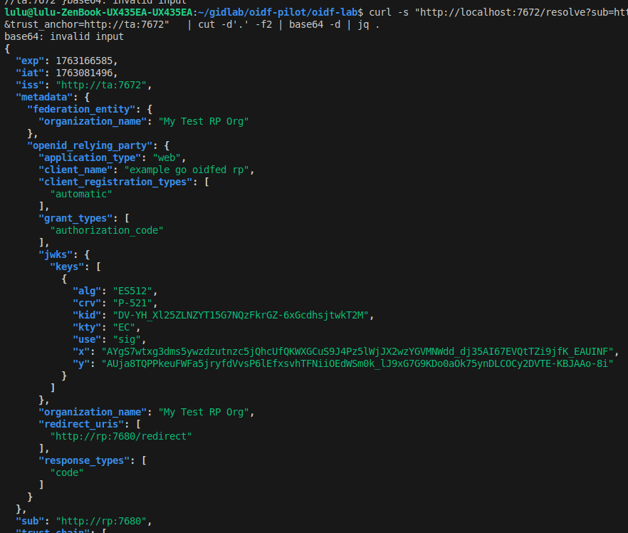

# Instância OpenID Federation (Lighthouse TA + IA + RP)

Este repositório contém um composição OpenID Federation baseado em [**Lighthouse**](https://go-oidfed.github.io/lighthouse/) e [**whoami-rp**](https://github.com/go-oidfed/whoami-rp).

## Checklist  

| Item | Status |
|------|--------|
| Trust Anchor (TA) | ✅ |
| Intermediate Authority (IA) | ✅ |
| Relying Party (RP) | ✅ |
| OpenID Provider (OP) | ❌    |
| Metadata Policy | ❌ |
| Trust Marks (OP/RP) | ❌ |


## 1. Estrutura de Diretórios

```bash
oidf-lab/
  docker-compose.yaml
  ta/
    config.yaml
    data/
      metadata-policy.json
      signing/ 
      storage/   
  ia/
    config.yaml
    data/
      metadata-policy.json
      signing/
      storage/
  rp/
    config.yaml     # whoami-rp
    data/          
```


## 2. Subindo a composição

```bash
# Imagem local do RP
cd whoami-rp-src
docker build -t oidfed/whoami-rp .

# Subir a composição (TA + IA + RP)
cd oidf-lab
docker compose up -d
``` 
 
## 3. Validação de fluxo

### 1) Ver TA
```bash
curl -s http://localhost:7672/.well-known/openid-federation | cut -d'.' -f2 | base64 -d
```

### 2) Ver IA
```bash
curl -s http://localhost:7673/.well-known/openid-federation | cut -d'.' -f2 | base64 -d
```

### 3) Ver RP
```bash
curl -s http://localhost:7680/.well-known/openid-federation | cut -d'.' -f2 | base64 -d
```

### 4) Enroll IA -> TA  
```bash
curl "http://localhost:7672/enroll?sub=http://ia:7673&entity_type=federation_entity"
```

### 5) Enroll RP -> IA  
```bash
curl "http://localhost:7673/enroll?sub=http://rp:7680&entity_type=openid_relying_party"
```

### 6) Resolve IA
```bash
curl -s "http://localhost:7672/resolve?sub=http://ia:7673&trust_anchor=http://ta:7672"   | cut -d'.' -f2 | base64 -d | jq .
```

### 7) Resolve RP (fluxo completo)
```bash
curl -s "http://localhost:7672/resolve?sub=http://rp:7680&trust_anchor=http://ta:7672"   | cut -d'.' -f2 | base64 -d | jq .
```

Saída: 


